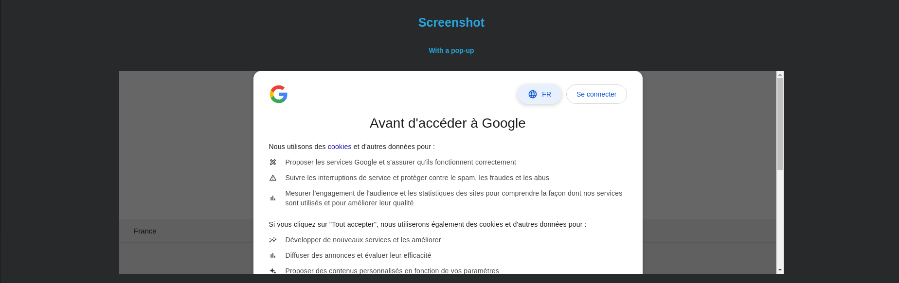

## Description

UrlMalGuard is an open source tool that performs a static and dynamic analysis of urls to check whether they are known to be used by malicious actors.  
To do this, UrlMalGuard analyses the html and javascript code for potentially malicious elements and uses regularly updated lists of urls, domains and ips (Openpish, Urlhaus, Adguardteam, Duggytuxy etc...).  
You can also use the VirusTotal, AlienVault OTX and MISP api.  
UrlMalGuard takes screenshot with and without the pop-up of the web browser.  

Currently, it can be used in French and English

#### Static analysis
Searched in url:
 - punycode
 - non-ascii caracters
 - shortened urls
 - typosquatting

Searched in html code analysis:
 - links whose domain is different from that of the url
 - hidden images (css opacity to 0)
 - hidden links (css opacity to 0)
 - hidden forms (css opacity to 0)
 - hidden inputs (css opacity to 0)
 - hidden iframes (css opacity to 0)

Searched in the analysis of javascript code:
 - redirections
 - recording keystrokes
 - DOM (Document Object Model) manipulation

Lists used (thanks to them for their titanic work):
 - url: Openphish, Urlhaus, Phishing Database, Phishunt, Urlabuse, Threatview, Trcert
 - domain: Phishing Army, ShadowWhisperer, Adguardteam, Duggytuxy, Discord-AntiScam, Wu Tingfeng, Threatview
 - ip: Duggytuxy, Bitwire, Binary Defense, Blocklist.de, Clean-MX.de, EmergingThreats.net, FireHOL

Threat hunting tools currently supported:
 - AlienVault OTX (only for information, score is not taken into account for calcul because of false positive during tests)
 - VirusTotal
 - MISP

#### Dynamic analysis

 - automatic file downloading
 - automatic redirection (reverse proxy etc...)

## Installation

The installation was tested on an Ubuntu 24.04 LTS server (minimal installation).

```
cd /home/*your_user*
sudo apt-get -y install git nano
git clone https://github.com/ctechmat/urlmalguard.git
cd urlmalguard/
```

If you want, you can add the VirusTotal, AlienVault OTX and MISP api keys as well as the MISP url to the env file.  
If you want to use UrlMalGuard behind a proxy, you can add it in env file (IP:PORT).

```
nano env
```

You can start the installation.

```
sudo chmod +x install.sh
./install.sh
```

Ports to open:
 - 8000: to access the api and web interface (but you can change it by editing urlmalguard_api.py)
 - 443: to allow https requests from UrlMalGuard to internet and MISP
 - 80: to allow http requests from UrlMalGuard to internet
 - 43: to allow whois requests from UrlMalGuard to internet
 - 53: to allow dns requests

To check urlmalguard logs:

```
journalctl -xefu urlmalguard.service
```

## Update

```
cd /home/*your_user*/urlmalguard/
git pull
sudo systemctl restart urlmalguard.service
```

## Usage
UrlMalGuard can be used by end users via its web interface. It can also be used in security workflows with its json format api.

Warning: the url must not contain an IP address or custom port (i.e.: not http<nolink>://8.8.8.8:443 or http<nolink>://8.8.8.8:5486 or http<nolink>://test.com:6875).

Using the web interface: simply connect to **http://your_ip:8000**

Using the api: **curl "http://your_ip:8000/api/analyse?url=url_to_analyse"**

## Contributing
If you know of regularly updated lists of urls, domains or ip that you want UrlMalGuard to support, you can create an issue.

If you know of any elements in html or javascript code that could be used maliciously, you can create an issue.

In general, if you would like to contribute to the project, you are welcome to do so.